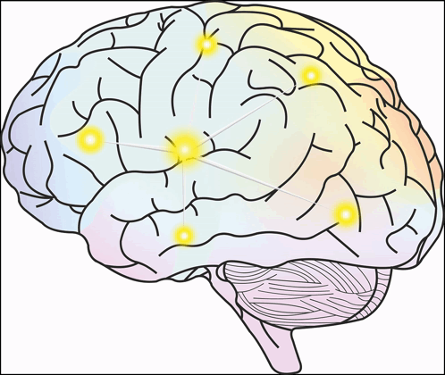

# Brain Tumor Detector

## Description
This project aims to detect and classify brain tumors using MRI images. Brain tumors are one of the most aggressive diseases, affecting both children and adults. Proper diagnosis and treatment planning are crucial for improving patient outcomes. Manual examination of MRI scans can be error-prone due to the complexity of brain tumors. Therefore, an automated classification system using Deep Learning models is proposed to assist radiologists in diagnosing brain tumors more accurately.

## Dataset
The dataset used in this project is sourced from Kaggle: [Brain Tumor Classification (MRI)](https://www.kaggle.com/datasets/sartajbhuvaji/brain-tumor-classification-mri). It contains MRI images classified into four categories:
- GLIOMA TUMOR
- MENINGIOMA TUMOR
- NO TUMOR
- PITUITARY TUMOR

The dataset is relatively small, which presents challenges in training deep learning models to achieve high accuracy.

## Overview
In this project, I have utilized Convolutional Neural Networks (CNNs) for image classification on the brain tumor dataset. Given the dataset's small size, training a neural network from scratch did not yield satisfactory results. To address this, I leveraged the concept of Transfer Learning, which significantly improved the model's performance.

## Motivation
Brain tumors account for 85 to 90 percent of all primary Central Nervous System (CNS) tumors. Each year, approximately 11,700 people are diagnosed with a brain tumor. The 5-year survival rate for individuals with a cancerous brain or CNS tumor is around 34 percent for men and 36 percent for women. The complexities involved in detecting and diagnosing brain tumors necessitate accurate and efficient methods to assist medical professionals. This project aims to provide an automated system for brain tumor detection, thereby reducing the burden on radiologists and increasing diagnostic accuracy.

## Technical Aspects
### Custom CNN Architecture
I initially implemented a custom CNN model to perform image classification. The architecture consists of convolutional layers, ReLU activations, max-pooling layers, dropout layers, and fully connected layers. Despite achieving an accuracy of 88.9%, the small dataset size limited the model's performance.

### Transfer Learning with EfficientNetB0
To overcome the dataset size limitation, I utilized Transfer Learning with EfficientNetB0, a state-of-the-art architecture known for its efficiency and performance. EfficientNetB0 scales the network dimensions—depth, width, and resolution—using a compound scaling method. By fine-tuning this pre-trained model on our dataset, I achieved an impressive accuracy of 97.2%.

### Visualization Utils
The `visualization_utils.py` file contains utility functions for visualizing the dataset and model performance. These visualizations include displaying sample images from each class, plotting training and validation accuracy/loss curves, and generating confusion matrices to evaluate model predictions.

## Results
- **Custom CNN Accuracy**: *88.96%*
- **Transfer Learning (EfficientNetB0) Accuracy**: *97.24%*

The significant improvement in accuracy using Transfer Learning highlights the effectiveness of pre-trained models, especially when dealing with smaller datasets. The visual representation of the custom CNN architecture and performance trends are available in the attached notebook.

## Conclusion
This project demonstrates the application of Deep Learning techniques, specifically CNNs and Transfer Learning, for brain tumor detection using MRI images. The use of EfficientNetB0 for Transfer Learning resulted in a substantial boost in accuracy, making the model more reliable for practical use. Automated classification systems like this can assist radiologists in making quicker and more accurate diagnoses, ultimately improving patient care.

I hope you find this project helpful and intuitive. Your suggestions and opinions are highly appreciated and will help me improve my work. Thank you! :)

## Requirements
The project is implemented in Python using PyTorch. The required libraries are listed in `requirements.txt`.

**Estimated Training Time**: Using Google Colab's T4 GPU, the models took approximately 4 minutes to train. On a local CPU, the training time will be significantly longer.

---

Feel free to explore the code and notebooks included in this repository to understand the implementation details and experiment with the models.
